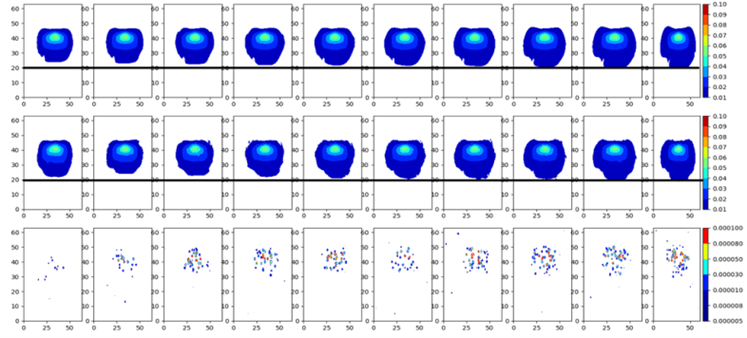

Conv-GRUConv2d
==============

**Conv-GRUConv2d** is to relize the short-term prediction for the natural gas release and dispersion accidental scence, which could support real-time emergency response planning. This approach is composed of convolutional layers, GRU layers and deconvolutional layers. This source code is coming soon.

### Resukt

	

</a>.
